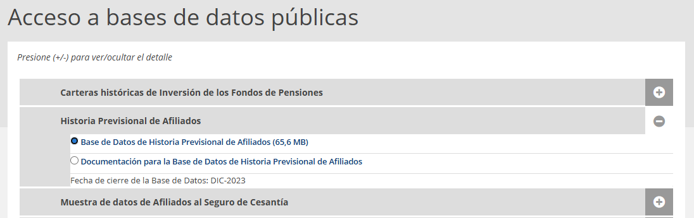
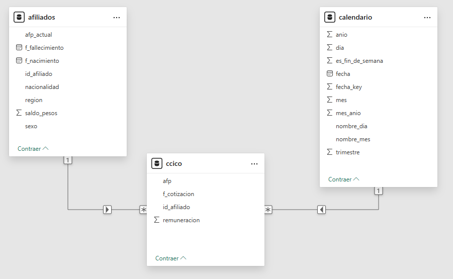
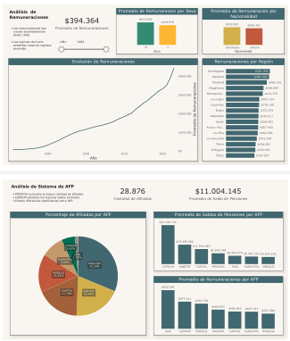

# 📊 Análisis del Sistema de Pensiones en Chile

Proyecto de ingeniería y análisis de datos basado en información real de la Superintendencia de Pensiones de Chile.  
Incluye ingestión, limpieza y transformación de datos utilizando Python y DuckDB, generación de datasets analíticos en formato Parquet y visualización en Power BI.

---

## 🎯 Objetivo

Analizar la evolución de las remuneraciones y la distribución del sistema de AFP en Chile, utilizando datos históricos reales.

---

## 🧩 Fuente de datos

Datos obtenidos desde la Superintendencia de Pensiones:

- `informacion_mensual_ccico.csv` -> Contiene Información mensual de cotizaciones (CCICO)
- `caracteristicas_afiliados.csv` -> Contiene caracteristicas como sexo, fecha de nacimiento y otros.

Para descargar los dataset necesarios debe dirigirse al portal de la [Superintendencia de Pensiones](https://www.spensiones.cl/), hacer clic en la pestaña `Estadísticas e Informes`, luego en la pestaña `Estadísticas y bases de datos` y luego en la opción `Acceso a bases de datos`; Esto le llevará a una nueva página desde donde dentro de la sección `Historia Previsional de Afiliados`, debe selecionar la opción `Base de datos de Historia Previsional de Afiliados`, y luego hacer clic en el botón <kbd>Descargar Archivo</kbd> que se encuentra al final de la página.



---

## ⚙️ Arquitectura del proyecto

```bash
chile-pension-data-pipeline/
├── assets/
├── bi/
│   ├── chile-pension.pbix
│   └── chile-pension.pdf
├── data/
│   ├── raw        # Datos originales
│   ├── processed  # datos limpios
│   └── curated    # Datos listos para análisis
├── logs/
│   └── app.log
├── notebooks/
│   └── data-exploration.ipynb 
├── src/
│   ├── __init__.py
│   ├── pipeline.py
│   └── utils.py
├── .gitignore
├── .python-version
├── main.py
├── pyproject.toml
├── README.md
└── uv.lock
```

---

## 🔎 Exploración de datos

Se realizó un análisis exploratorio inicial en un notebook de Jupyter utilizando la librería pandas para comprender la estructura, calidad y comportamiento de los datos.

- Archivo: [`notebooks/data-exploration.ipynb`](notebooks/data-exploration.ipynb)

### Principales análisis realizados

- Revisión de estructura y tipos de datos
- Identificación de valores nulos y datos inconsistentes
- Validación de duplicados
- Análisis de distribución de variables clave (remuneraciones, saldos, etc.)
- Evaluación de calidad de fechas (nacimiento, cotizaciones, etc.)

### Hallazgos relevantes

- Existen registros duplicados en las cotizaciones (CCICO)
- Se detectaron valores nulos en algunas variables financieras
- Presencia de fechas inconsistentes (ej: afiliados con edades improbables)
- Distribución de remuneraciones con sesgo hacia valores bajos

### Impacto en el pipeline

Los hallazgos del análisis exploratorio permitieron definir:

- Reglas de limpieza de datos
- Filtros aplicados en las transformaciones
- Estandarización de formatos (fechas, montos)
- Eliminación de registros inválidos

**El notebook no forma parte del pipeline productivo, pero fue clave para definir la lógica de transformación aplicada posteriormente.*

---

## 🔄 Pipeline de datos

El pipeline sigue principalmente un enfoque ELT (Extract, Load, Transform) utilizando DuckDB como motor de procesamiento.

Los datos son extraídos desde archivos CSV y cargados directamente en el motor de DuckDB, donde se realizan las transformaciones mediante consultas SQL. Finalmente, los datos procesados se almacenan en formato Parquet para su posterior análisis en Power BI.

Este enfoque permite trabajar de forma eficiente con grandes volúmenes de datos, aprovechando la capacidad de DuckDB para ejecutar transformaciones directamente sobre los datos sin necesidad de cargarlos completamente en memoria.

- Archivo: [`pipeline.py`](src/pipeline.py)

1. Validación de existencia de los archivos de entrada
2. Lectura de archivos CSV
3. Carga de los datos en el motor de DuckDB
4. Limpieza y transformación con SQL
5. Construcción de dataset analítico
6. Construcción de tabla de calendario
7. Generación de datasets en formato Parquet


### 🛠 Tecnologías utilizadas

- Python
- DuckDB
- Pandas
- Loguru

---

## 🧠 Modelado de datos y visualización

**Origen de los datos:** Archivos Parquet generados por el pipeline.

### 🛠 Tecnologías utilizadas

- Power BI

### 🧩 Modelo de datos

Modelo tipo estrella:

- **Fact table:** ccico (cotizaciones)
- **Dimensiones:**
  - afiliados
  - calendario

Relaciones:

- `ccico.id_afiliado → afiliados.id_afiliado`
- `ccico.f_cotizacion → calendario.fecha`



### 📊 Dashboard

El análisis se divide en dos páginas:

#### 1. Remuneraciones

- Evolución de remuneraciones en el tiempo
- Comparación por sexo, nacionalidad y región
- Distribución de ingresos

#### 2. Sistema de AFP

- Participación de afiliados por AFP
- Promedio de saldos de pensiones
- Comparación de remuneraciones por AFP


### 🔍 Principales insights

- Las remuneraciones muestran una tendencia creciente sostenida en el tiempo
- Existen diferencias significativas en remuneración promedio entre AFP
- Regiones del norte presentan mayores ingresos promedio en comparación con el resto del país
- La distribución de afiliados entre AFP no es homogénea, evidenciando concentración en algunas entidades

---

## ▶️ Cómo ejecutar el proyecto

- El proyecto usa el gestor de paquetes [uv](https://docs.astral.sh/uv/), el cual permite facilmente reproducir el entorno necesario para el proyecto instalando las librerias necesarias en un solo paso y a gran velocidad. Puede instalar esta herramienta en Windows ejecutando el siguiente comando desde la consola de PoweShell.

    ```shell
    powershell -ExecutionPolicy ByPass -c "irm https://astral.sh/uv/install.ps1 | iex"
    ```

- Clonar el repositorio:

    SSH
    ```shell
    git clone git@github.com:GuerreroSUD/chile-pension-data-pipeline.git
    ```
    HTTPS
    ```shell
    git clone https://github.com/GuerreroSUD/chile-pension-data-pipeline.git
    ```

- Ingresar al proyecto
    ```shell
    cd chile-pension-data-pipeline
    ```

- Reproducir el entorno
    ```shell
    uv sync
    ```

- Depositar los archivos de entrada en la ruta: `data/raw`
- Ejecutar el proyecto
    ```shell
    uv run main.py
    ```

La ejecución generará los siguientes archivos:
- `data/curated/ccico.parquet`
- `data/curated/afiliados.parquet`
- `data/curated/calendario.parquet`
- `data/processed/dataset_analitico.parquet`

Puede descargar el archivo Power BI desde:
- [bi/chile-pension.pbix](bi/chile-pension.pbix)

Alternativamente tambien puede ver y descargar un pdf con las visualizaciones
- [bi/chile-pension.pdf](bi/chile-pension.pdf)



---

## ⚠️ Notas
- Los datos crudos (data/raw) no están versionados por su tamaño
- El proyecto utiliza datos públicos

---

## 👨‍💻 Autor

Roberto Guerrero
